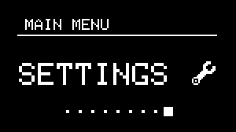
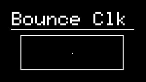

# Clock Generators

---


## About Clock Generators

{align=right}

NGEN includes 4 clock generators that can be used for clocking all 16 [tracks](track.md). 

Each clock generator has a separate clock count and can trigger all tracks relative to it. This means multiple clock generators can be active at the same time.

While in the CLOCK sub-menu, the most relevant parameters for the selected clock generator are mapped to the NGEN's potentiometers.

---

## Selecting a Clock

To select a different clock, navigate to the **CLOCK** sub-menu (from the **MAIN MENU**), hold down the ++"TRACK / CLK"++  button and turn the ++"MENU ENCODER"++.

The name of the selected clock generator will be displayed on the top-left section of the display.

---

## List of Available Clock Generators

### MIDI Clock

{align=right}

The MIDI Clock is the default clock generator used by NGEN. While active, the MIDI Clock will sync to 24 PPQN MIDI Clock signals received via the MIDI IN jack and USB.

<br/><br/>

**Parameter List:**

| **Parameter** | **Description**                      | **Hardware Mapping** |
|---------------|--------------------------------------|:--------------------:|
| **Swing**     | Sets the swing amount for all tracks |    ++"PARAM 1"++     |

### Free Clock

The Free Clock is the NGEN's internal clock and it can be used to generate an internal clock when no external MIDI Clock is available.
It also features an 8-stage swing sequencer that can be used to create interesting swing patterns.

<br/>

**Parameter List:**

| **Parameter** | **Description**                      | **Hardware Mapping** |
|---------------|--------------------------------------|:--------------------:|
| **BPM**       | Sets the BPM for the internal clock   |    ++"PARAM 1"++     |
| **Length**    | Sets the length of the swing sequence |    ++"PARAM 2"++     |
| **Modulation (```MOD```)**    | Sets the amount of clock modulation (swing)              |    ++"PARAM 3"++     |
| **Swing**    | Sets the swing amount |    -     |
| **Generate**  | Generates a new swing sequence       |    ++"GENERATE"++    |


### Bounce Clock

{align=right}

The Bounce Clock is an experimental clock generator that uses virtual balls (dots) enclosed in a box to generate its clock signal. The clock advances whenever one of the balls collides with box boundaries.
The number of balls and the shape of the box can be controlled via the available parameters.

<br/>

**Parameter List:**

| **Parameter** | **Description**                               | **Hardware Mapping** |
|---------------|-----------------------------------------------|:--------------------:|
| **Speed**     | Sets the speed of the balls                   |    ++"PARAM 1"++     |
| **Balls**     | Sets the number of balls                      |    ++"PARAM 2"++     |
| **Width**     | Sets the width of the box                     |    ++"PARAM 3"++     |
| **Height**    | Sets the height of the box                    |    ++"PARAM 4"++     |
| **Reset**     | Reset the position of all balls to the center |    ++"GENERATE"++    |
