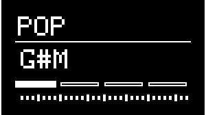

# Generator

---

## About Generators
{align=right}

The generators in NGEN are used to generate MIDI notes/sequences to play external MIDI instruments.

Each generator uses a specific algorithm to create a unique MIDI sequence based on certain ideas, musical styles, and production techniques. These sequences can then be modified and interacted with via the different parameters available in each generator.

The output of each generator is routed to the [Track](track.md)'s both MIDI out and Aux Out (which can be used to send MIDI notes from one track to another).

Each track can load any of the available generators.

!!! info 
    The animations for each generator are displayed via the Idle Mode feature while in the Generator sub-menu. To see the animations, set  Idle Mode is set to ```Animation``` in the [Settings](settings.md#display), navigate to the Generator sub-menu and leave the machine idle until the display switch to the Idle Mode.

---

## Generator Parameters

While in the **GENERATOR** sub-menu or the **MAIN MENU**, the main parameters of the selected generator are mapped to the NGEN 4 knobs (++"PARAM 1"++, ++"PARAM 2"++, ++"PARAM 3"++, and ++"PARAM 4"++): 

* 4 Parameters are mapped to the knobs directly.
* 4 Additional parameters are accessible by holding down ++"FUNCTION"++ while moving the knobs.

Some parameters such as Length, Shift and Density are available in many of the available generators. These common parameters are always mapped to the same knobs to improve usability and consistency.

A complete list of parameters available for the selected Generator can be accessed via the **GENERATOR** sub-menu available in the **MAIN MENU**.

-----


## List of Available Generators

---

### ACDGEN

{align=right}

**Generator Description:**

ACDGEN is a generator that uses the [Spektro Audio ACDGEN](http://spektroaudio.com/acdgen) algorithms to generate melodies and basslines.

The 8 different algorithms available in ACDGEN can generate sequences that vary in style and purpose:

• *Normal*: A straightforward random algorithm.  
• *Floor*: Uses a smaller selection of notes and has a higher probability of playing the fundamental / base note (great for basslines).  
• *FifthOct*: Limits the note selection to the fundamental / base note and its fifth.  
• *Upwards*: Generates a sequence that tends to go up in the active scale.  
• *Up-Stepped*: Similar to Upwards but it can also alternate between higher notes and the fundamental / base note.  
• *Downwards*: Generates a sequence that tends to go down in the active scale.  
• *Down-Stepped*: Similar to Downwards but it can also alternate between lower notes and the fundamental / base note.  
• *ARP3*: Algorithm inspired by arpeggiated sequences.
• *LEAD*: Generates sequences with longer and more sustained notes that can be used for lead lines and main melodies.
• *LEGATO*: Generates sequences where all notes are played in legato (each note lasts until the next note)


**Parameter List:**

| **Parameter**                  |                         **Description**                         |          ** Hardware Mapping ** |
|--------------------------------|:---------------------------------------------------------------:|--------------------------------:|
| Generate                       |                    Generates a new sequence.                    |                  ++"GENERATE"++ |
| Variate                        | Generates a new variation of the previously generated sequence. | ++"FUNCTION"++ + ++"GENERATE"++ |
| Shift                          |              Transposes the sequence diatonically.              |                   ++"PARAM 1"++ |
| Length                         |                Sets the length of the sequence.                 |                   ++"PARAM 2"++ |
| Density                        |                Sets the sequence's note density.                |                   ++"PARAM 3"++ |
| Algorithm                      |      Selects the mode used to generate the next sequence.       |                   ++"PARAM 4"++ |
| KB Shift                       |               Toggles the keyboard shift feature (transposition via MIDI input).               |                               – |
| Note Len                       |      Sets the proportional note length of generated notes.      |  ++"FUNCTION"++ + ++"PARAM 2"++ |
| Random Vel                     |            Sets the amount of random MIDI velocity.             |  ++"FUNCTION"++ + ++"PARAM 3"++ |
| Hold Prob                      |                   Sets the hold probability (for generating notes longer than 1/16).                    |  ++"FUNCTION"++ + ++"PARAM 4"++ |
| Octave                         |             Sets the base octave for the sequence.              |  ++"FUNCTION"++ + ++"PARAM 1"++ |
| Slide Prob                     |         Sets the probability of generating slide steps          |                               – |
| Base Velocity (```Base Vel```) |         Sets the base MIDI velocity of generated notes          |                               - |
| Accent                         |                     Sets the accent amount                      |                               - |
| Offset                         |                     Sets a beat offset for the ACDGEN sequence (in 1/16 steps).             |                               - |

---

### ARPER

{align=right}

** Generator Description: **

Arper is a generator designed to generate classic arpeggios using an algorithmically generated chord progression.

<br/><br/><br/>

**Parameter List:**


| **Parameter** |                          **Description**                          |           **Hardware Mapping** |
|---------------|:-----------------------------------------------------------------:|-------------------------------:|
| Generate      |                     Generates a new sequence.                     |                 ++"GENERATE"++ |
| Restart       |                       Restarts the sequence                       |                              - |
| Bass Shift    |              Transposes the bass note diatonically.               |                  ++"PARAM 1"++ |
| Shift         |           Transposes the additional notes diatonically.           |                  ++"PARAM 2"++ |
| Bars          |           Sets the length of the total sequence in bars           |                  ++"PARAM 3"++ |
| Spread        |                Sets the distance between intervals                |                  ++"PARAM 4"++ |
| Octave        |              Sets the base octave for the sequence.               | ++"FUNCTION"++ + ++"PARAM 1"++ |
| Octave Random | Sets the probability of randomizing the octave of generated notes | ++"FUNCTION"++ + ++"PARAM 2"++ |
| Density       |                   Sets the sequence's density.                    | ++"FUNCTION"++ + ++"PARAM 3"++ |
| Bass RPT      |             Sets how often the bass note gets played              | ++"FUNCTION"++ + ++"PARAM 4"++ |
| Note Len      |       Sets the proportional note length of generated notes.       |                              – |
| Bass Lock     |             Locks the bass note to the root note of the scale.     |                              – |


---

### DRUMGEN

{align=right}

**Generator Description:**

DrumGen is a 4-part drum sequencer that uses 3D probability templates to generate sequences based on certain music styles.

A new template can be selected via the **TEMPLATE** parameter or by pressing **SHIFT** + **Generate**. 

The 4 parts are completely independent and can be set to individual sequence lengths, probability and MIDI notes.

New DrumGen templates can be created using the open-source [DrumGen Template Editor](https://github.com/SpektroAudio/DrumGenTemplateEditor).

**Parameter List**

| **Parameter** |         **Description**          |          ** Hardware Mapping ** |
|---------------|:--------------------------------:|--------------------------------:|
| Generate      |     Generates a new sequence     |                  ++"GENERATE"++ |
| Density 1     |    Sets part 1's probability     |                   ++"PARAM 1"++ |
| Density 2     |    Sets part 2's probability     |                   ++"PARAM 2"++ |
| Density 3     |    Sets part 3's probability     |                   ++"PARAM 3"++ |
| Density 4     |    Sets part 4's probability     |                   ++"PARAM 4"++ |
| Length 1      |  Sets part 1's sequence length   |  ++"FUNCTION"++ + ++"PARAM 1"++ |
| Length 2      |  Sets part 2's sequence length   |  ++"FUNCTION"++ + ++"PARAM 2"++ |
| Length 3      |  Sets part 3's sequence length   |  ++"FUNCTION"++ + ++"PARAM 3"++ |
| Length 4      |  Sets part 4's sequence length   |  ++"FUNCTION"++ + ++"PARAM 4"++ |
| Note 1        |      Set part 1's MIDI note      |                              -- |
| Note 2        |      Set part 2's MIDI note      |                              -- |
| Note 3        |      Set part 3's MIDI note      |                              -- |
| Note 4        |      Set part 4's MIDI note      |                              -- |
| Template      |      Selects a new template      | ++"FUNCTION"++ + ++"GENERATE"++ |
| Random        | Adds randomness to the sequence. |                        -        |

---


### INPUT SEQUENCE (```INSEQ```)

{align=right}

**Generator Description:**

The Input Sequencer is a non-algorithmic generator that lets you record incoming MIDI notes to it's sequence (up to 32 steps) and play them back.

Recorded sequences can be manipulated using parameters such as Length, Probability and Note Length.

**Parameter List:**

| **Parameter**                |                    **Description**                    |         ** Hardware Mapping ** |
|------------------------------|:-----------------------------------------------------:|-------------------------------:|
| Recording                    |                   Toggles recording                   |                                |
| Direction                    |              Sets the playback direction              |                  ++"PARAM 4"++ |
| Shift                        |         Transposes the sequence diatonically.         |                  ++"PARAM 1"++ |
| Length                       |           Sets the length of the sequence.            |                  ++"PARAM 2"++ |
| Probability (```Prob```)     |           Sets the probability of playing back notes in the sequence.            |                  ++"PARAM 3"++ |
| Note Length (```Note Len```) | Sets the proportional note length of generated notes. | ++"FUNCTION"++ + ++"PARAM 2"++ |
| Quantize                     |         Toggles pitch quantization of the sequence (based on the active Key and [Scale](scale.md)).         |               -                |

---

### MARP

{align=right}

**Generator Description:**

MARP is designed to generate arpeggios by creating separate note sequences for each of its 4 parts and combining them.

Each of these four parts is assigned to a different note (the first one is always set to the root note of the select key and scale) and also features individual Length parameters.

Changing the individual length of each of the 4 parts can result in interesting polyrhythmic sequences. 

**Parameter List:**

| **Parameter** |                **Description**                 |         ** Hardware Mapping ** |
|---------------|:----------------------------------------------:|-------------------------------:|
| Generate      |            Generates a new sequence            |                 ++"GENERATE"++ |
| Shift         |     Transposes the sequence diatonically.      |                  ++"PARAM 1"++ |
| Length        |     Sets the total length of the sequence.     |                  ++"PARAM 2"++ |
| Density       |          Sets the sequence's density.          |                  ++"PARAM 3"++ |
| Offset        |        Sets the offset of the sequence.        |                  ++"PARAM 4"++ |
| Length 1      | Sets the length of the first note's sequence.  | ++"FUNCTION"++ + ++"PARAM 1"++ |
| Length 2      | Sets the length of the second note's sequence. | ++"FUNCTION"++ + ++"PARAM 2"++ |
| Length 3      | Sets the length of the third note's sequence.  | ++"FUNCTION"++ + ++"PARAM 3"++ |
| Length 4      | Sets the length of the fourth note's sequence. | ++"FUNCTION"++ + ++"PARAM 4"++ |

---

### MIDI PLAYER

{align=right}

**Generator Description:**

MIDI PLAYER lets you load MIDI loops from .mid files stored in the MIDI folder of the SD card. It was designed to give users an option to play back specific / pre-recorded MIDI loops during live performances.

Because it was designed to work with simple MIDI loops, MIDI PLAYER only works with .mid files that contain 1 channel and less than 128 notes.

Loops can be manipulated in real time by adjusting the Length, Direction, Shift and Density parameters. It's also possible to re-quantize the notes in the loop to the active Key and Scale.

**Parameter List:**


| **Parameter** |                **Description**                 |         ** Hardware Mapping ** |
|---------------|:----------------------------------------------:|-------------------------------:|
| Load File      |            Loads a new MIDI file.            |                 ++"GENERATE"++ |
| Transpose         |     Transposes the sequence.      |                  ++"PARAM 1"++ |
| Length        |     Sets the total length of the sequence.     |                  ++"PARAM 2"++ |
| Density       |          Sets the sequence's density.          |                  ++"PARAM 3"++ |
| Offset        |        Sets the offset of the sequence.        |                  ++"PARAM 4"++ |

---

### NSL ENGINE

**Generator Description:**

The NSL Engine is a programmable generator that can run NSL files and features a 32-step sequencer.

For more information about NSL (NGEN Scripting Language), check out the [NSL documentation](nsl.md).

**Parameter List:**

| **Parameter** |                   **Description**                    |          ** Hardware Mapping ** |
|---------------|:----------------------------------------------------:|--------------------------------:|
| Generate      |              Generates a new sequence.               |                  ++"GENERATE"++ |
| Variate       | Generates a variation based on the current sequence. | ++"FUNCTION"++ + ++"GENERATE"++ |
| Shift         |        Transposes the sequence diatonically.         |                   ++"PARAM 1"++ |
| Length        |        Sets the total length of the sequence.        |                   ++"PARAM 2"++ |
| Density       |             Sets the sequence's density.             |                   ++"PARAM 3"++ |
| Param 1       |                 Generic parameter 1                  |  ++"FUNCTION"++ + ++"PARAM 1"++ |
| Param 2       |                 Generic parameter 2                  |  ++"FUNCTION"++ + ++"PARAM 2"++ |
| Param 3       |                 Generic parameter 3                  |  ++"FUNCTION"++ + ++"PARAM 3"++ |
| Param 4       |                 Generic parameter 4                  |  ++"FUNCTION"++ + ++"PARAM 4"++ |
| Load File     |                   Loads a NSL file                   |                               - |

---

### POLYFORM

{align=right}

**Generator Description:**

Polyform is a reactive generator based on the [Spektro Audio Polyform](http://spektroaudio.com/polyform) Max for Live device. It uses a polyphonic algorithm designed to respond to incoming MIDI notes.

Because of its responsive nature, Polyform can generate polyphonic sequences based on an incoming monophonic sequence in real-time. Feed it a bassline and it'll automatically generate some chords to go on top of it. If the bassline changes, Polyform will adjust it's own sequences automatically.

In order to use Polyform, route the output of another [Track](track.md) to Polyform's track via the [Aux Out](track.md#auxout).

**Parameter List:**


| **Parameter**                          |                        **Description**                        |          ** Hardware Mapping ** |
|----------------------------------------|:-------------------------------------------------------------:|--------------------------------:|
| Generate                               |                   Generates a new sequence.                   |                  ++"GENERATE"++ |
| Variate                                |     Generates a variation based on the current sequence.      | ++"FUNCTION"++ + ++"GENERATE"++ |
| Shift                                  |             Transposes the sequence diatonically.             |                   ++"PARAM 1"++ |
| Length                                 |            Sets the total length of the sequence.             |                   ++"PARAM 2"++ |
| Density                                |                 Sets the sequence's density.                  |                   ++"PARAM 3"++ |
| Delay                                  |           Sets the delay for generated note (x/16)            |                   ++"PARAM 4"++ |
| Pitch Probability (```Pitch %```)      |                  Sets the pitch probability.                  |  ++"FUNCTION"++ + ++"PARAM 1"++ |
| Gate Probability (```Gate %```)        |                  Sets the gate probability.                   |  ++"FUNCTION"++ + ++"PARAM 2"++ |
| Chord Probability (```Chord %```)      |                  Sets the chord probability.                  |  ++"FUNCTION"++ + ++"PARAM 3"++ |
| Inversion Probability (```Inversion```) |        Sets the probability of random chord inversion         |                               - |
| Inversion Range (```Inv Range```)      |            Sets the range of the chord inversions             |                               - |
| Chord Quality (```Chord Q```)          | Selects the preset of chord intervals used to generate chords |                               - |
| Trigger                                |   Sets the mode for advancing Polyform's internal sequence    |                               - |

---

### POP

{align=right}

**Generator Description:**

POP is designed to generate traditional chord progressions algorithmically. 

When generating a new sequence, POP selects 4 chords and generates a gate sequence to play those chords. POP will advance to the next chord after a certain number of steps determined by the Chord Length parameter.

POP will generate triads (3-note chords) by default but it can also invert chords and generate different types of chords (+7, +9, +13, sus2, sus4) according to the Inv Prob and Type Prob parameters respectively.

The MIDI velocity of generated chords is determined by the Velocity and Balance parameters. Velocity determines the base velocity of the chords and Balance determines the correlation between MIDI velocity and note lenghts.  
At 50, Balance uses the same velocity for short and long notes. At 0, short notes will have a higher velocity and long notes will have a lower velocity. At 100, short notes will have a lower velocity and long notes will have a higher velocity.


Modes:

• **STABS**: Generates a sequence of stabs (short chords) that can be used for house, techno, and other dance music genres. In this mode, Density disables certain chords in the sequence based on their density value.  
• **FIXED LEN**: Generates a sequence of chords with a fixed length and a top melody. In this mode, Density controls the density of the top melody.  
• **VARI LEN**: Generates a sequence of chords with variable length. In this mode, Density controls the density of generated chords.  


**Parameter List:**


| **Parameter**                          |                **Description**                 |                      ** Hardware Mapping ** |
|----------------------------------------|:----------------------------------------------:|--------------------------------------------:|
| Generate                               |            Generates a new sequence            |                              ++"GENERATE"++ |
| Shift                                  |     Transposes the sequence diatonically.      |                               ++"PARAM 1"++ |
| Length                                 |     Sets the total length of the sequence.     |                               ++"PARAM 2"++ |
| Density                                |          Sets the sequence's density.          |                               ++"PARAM 3"++ |
| Velocity                               |   Sets the base velocity of generated notes.   |                               ++"PARAM 4"++ |
| Type Probability (```Type Prob```)     | Sets the probability of different chord types. |              ++"FUNCTION"++ + ++"PARAM 1"++ |
| Chord Length (```Chord Len```)         |         Sets the length of each chord.         |              ++"FUNCTION"++ + ++"PARAM 2"++ |
| Inversion Probability (```Inv Prob```) |   Sets the probability of chord inversions.    |              ++"FUNCTION"++ + ++"PARAM 3"++ |
| Balance                                |    Sets the velocity of short x long notes. | ++"FUNCTION"++ +              ++"PARAM 4"++ |
| Mode                                   |       Sets the POP mode.      |                                            - |


---

### SAMBA

{align=right}

**Generator Description:**

Samba is a percussive generator inspired by the Brazilian genre and based on a 4-part euclidean sequencer. All four parts are controlled by shared parameters.
Although named after a specific genre, Samba is capable of generating percussing rhythms/grooves that can be used for all kinds of different genres.

Note Length Modes:

• **FIXED**: All notes have the same length (1/16).
• **DYNAMIC 1**: Sets the length of the notes based on the length of each part's sequence.
• **DYNAMIC 2**: Sets the length of the notes based on the number of notes in each part's sequence.

**Parameter List:**

| **Parameter**            |             **Description**             |         ** Hardware Mapping ** |
|--------------------------|:---------------------------------------:|-------------------------------:|
| Generate                 |        Generates a new sequence         |                 ++"GENERATE"++ |
| Spread                   |         Offsets all four parts.         |                  ++"PARAM 1"++ |
| Length                   | Sets the total length of the sequence.  |                  ++"PARAM 2"++ |
| Density                  |      Sets the sequence's density.       |                  ++"PARAM 3"++ |
| Random                   |  Sets the probability of random hits.   |                  ++"PARAM 4"++ |
| Rotate                   |   Rotates all four sequences forward.   | ++"FUNCTION"++ + ++"PARAM 1"++ |
| Probability (```Prob```) | Sets the probability of all four parts. | ++"FUNCTION"++ + ++"PARAM 2"++ |
| Note 1                   |         Set part 1's MIDI note          |                             -- |
| Note 2                   |         Set part 2's MIDI note          |                             -- |
| Note 3                   |         Set part 3's MIDI note          |                             -- |
| Note 4                   |         Set part 4's MIDI note          |                             -- |
| Note Len                | Sets the note length mode. |                             -- |

---

### SHUFFLER

{align=right}

**Generator Description:**

Shuffler is a generator designed to play and mangle sliced loops. To get the most out of Shuffler, it's recommended that loops are sliced by the grid (preferably 1/16 or 1/8).

The different modes available in Shuffler are capable of sequencing the slices in different ways: 

• *Sequenced (```SEQ```): This mode uses a generated sequence to play the slices in a different order to create new variations of the loop.
• *Forward (```FWWRD```)*: Uses a non-quantized rising note sequence according to the Start note and Length. This mode will play loops sliced in 1/16 in their original form.
• *Forward (```BCKWRD```)*: Similar to Mode 0 (Forward) except it'll play the slices in reverse/backward.

**Parameter List:**


| **Parameter**                       |                    **Description**                    |         ** Hardware Mapping ** |
|-------------------------------------|:-----------------------------------------------------:|-------------------------------:|
| Generate                            |               Generates a new sequence (for SEQ mode)                |                 ++"GENERATE"++ |
| Variate                             | Generates a variation based on the current sequence.  | ++"FUNCTION"++ + ++"GENERATE"++ |
| Repeat                              |            Set the number of note repeats.            |                  ++"PARAM 1"++ |
| Length                              |           Sets the length of the sequence.            |                  ++"PARAM 2"++ |
| Density                             |           Sets the sequence's note density.           |                  ++"PARAM 3"++ |
| Mode                                |                Sets the playback mode.                |                  ++"PARAM 4"++ |
| Note Length (```Note Len```)        | Sets the proportional note length of generated notes. | ++"FUNCTION"++ + ++"PARAM 2"++ |
| Random Probability (```Rnd Prob```) |    Sets the probability of playing a random note.     | ++"FUNCTION"++ + ++"PARAM 4"++ |
| Quantize                            |              Enables pitch quantization               |               -                |
| Start                               |           Sets the pitch of the first slice           |               -                |

---
 
### THRU

{align=right}

**Generator Description:**

The Thru generator is a simple pass-through generator that can be used for duplicating notes generated from a different track or further processing sequences through an additional MIDI FX slot (routed via the [Tracks](track.md)' Aux Output).

<br><br>

**Parameter List:**


| **Parameter**                   |                   **Description**                    | ** Hardware Mapping ** |
|---------------------------------|:----------------------------------------------------:|-----------------------:|
| Shift                           |           Transposes incoming MIDI notes.            |          ++"PARAM 1"++ |
| Max Velocity (```Max Vel```)    |             Sets the max MIDI velocity.              |          ++"PARAM 2"++ |
| Probability                     | Sets the probability of playing back incoming notes. |          ++"PARAM 3"++ |
| Random Velocity (```Rnd Vel```) |         Sets the amount of random velocity.          |          ++"PARAM 4"++ |
| Quantize                        |              Enables pitch quantization              |           -            |
| Delay                           |           Delays incoming note by x beats            |           -            |

---

### TURING

{align=right}

**Generator Description:**

Turing is an algorithm inspired by the [Music Thing's Turing Machine](https://www.musicthing.co.uk/Turing-Machine/). It uses a lockable 16-bit shift register to generate evolving sequences.

**Parameter List:**

| **Parameter**                 |                            **Description**                            |          ** Hardware Mapping ** |
|-------------------------------|:---------------------------------------------------------------------:|--------------------------------:|
| Write                         |                         Flips the first bit.                          |                  ++"GENERATE"++ |
| Clear                         |                      Clears the shift register.                       | ++"FUNCTION"++ + ++"GENERATE"++ |
| Shift                         |                 Transposes the sequence diatonically.                 |                   ++"PARAM 1"++ |
| Length                        |                   Sets the length of the sequence.                    |                   ++"PARAM 2"++ |
| Probability (```Prob```)      |            Sets the probability of flipping the first bit.            |                   ++"PARAM 3"++ |
| Loop                          | Sets the probability of copying the last bit back into the first bit. |                   ++"PARAM 4"++ |
| Octave                        |                Sets the base octave for the sequence.                 |  ++"FUNCTION"++ + ++"PARAM 1"++ |
| Spread                        |         Spreads the shift register read position between the different voices.          |  ++"FUNCTION"++ + ++"PARAM 2"++ |
| Range                         |         Sets the pitch range of the sequence (in semitones).          |  ++"FUNCTION"++ + ++"PARAM 3"++ |
| Clock Shift (```Clk Shift```) | Sets the clock shift (offset) for the shift register (in 1/16 steps). |                               - |
| Voices                        |                      Sets the number of voices.                       |  ++"FUNCTION"++ + ++"PARAM 4"++ |
