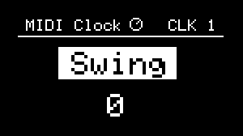
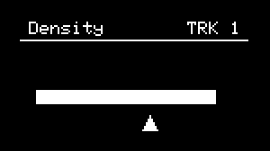

# Hardware Controls

---

## Hardware Controls on NGEN

The NGEN includes a main clickable encoder (++"MENU ENCODER"++), a return button (++"RETURN"++), 4 parameter knobs (++"PARAM 1"++ through ++"PARAM 4"++), and 4 buttons (++"TRACK/CLK"++, ++"PATTERN"++, ++"FUNCTION"++, and ++"GENERATE"++) that can be used to access and control different features.


---

## Encoder

The ++"MENU ENCODER"++ can be used for navigating menus, activating patterns, selecting the active track/clock, selecting different parameters, changing their value, and selecting files.

Turn the ++"MENU ENCODER"++ to select a different sub-menu, file or parameter.  
Press/Click the ++"MENU ENCODER"++ to select a sub-menu or file or switch between parameter selection and value adjustment.

The ++"MENU ENCODER"++ can also be combined with other buttons to perform different operations.

Please refer to the [shortcuts](gettingstarted.md#shortcuts) table for more information.

---


## Knobs

The 4 knobs (++"PARAM 1"++, ++"PARAM 2"++, ++"PARAM 3"++, and ++"PARAM 4"++) in NGEN serve different purposes depending on which menu is active.

The default behavior of the 4 parameters is to control the main parameters of the selected [**Generator**](generators.md) of the active [**Track**](track.md).

Additional parameters can be controlled by turning the 4 knobs while holding down ++"FUNCTION"++.



{align=right}

While in the **[MIDI FX](midifx.md)**, **[SCALE](scale.md)** and **[CLOCK](clockgen.md)** menus, the 4 knobs are mapped to parameters related to those features (note the knob icon on the top section of the display). Exiting those menus will revert the knob mapping to the **[Generator](generators.md)** parameters.

### Pick-up Behaviour

If the position of a knob does not match the value of the parameter that it's trying to control, the knob gets disabled and enters a pick-up state.  

While in this state, a pick-up screen will be displayed to indicate the position of the knob relative to the parameter's value.



To re-enable the knob, turn the knob so its position matches the current value of the parameter.  

---

## Buttons

The four hardware buttons included in ```NGEN``` perform specific functions when pressed individually. Shortcuts and secondary functions can be accessed via Shortcuts (see table below).

* ++"TRACK / CLK"++ : Enables track/clock selection (by holding the button down and turning the ++"MENU ENCODER"++).

* ++"PATTERN"++ : Selects the active pattern.

* ++"FUNCTION"++ : Modifies the behavior of the other buttons to enable access to additional functions (see [Shortcuts](#shortcuts)).

* ++"GENERATE"++ : Call the main function of the active **[Generator](generators.md)**, **[MIDI FX](midifx.md)** or **[Clock](clockgen.md)**.

* ++"RETURN"++ : Returns to the previous menu.


---

## Shortcuts

A list of shortcuts available is available on the [Menu Navigation](menunavigation.md#shortcuts) page.

---

## Special Behavior

Certain NGEN features (such as the scale editor, name editor, and file selector) can have more control over NGEN's hardware controls and, as such, can use the available hardware controls in different ways.  

The standard behavior for NGEN's controls should be restored once you complete the operation or exit the feature (e.g. by pressing the ++"RETURN"++ button).