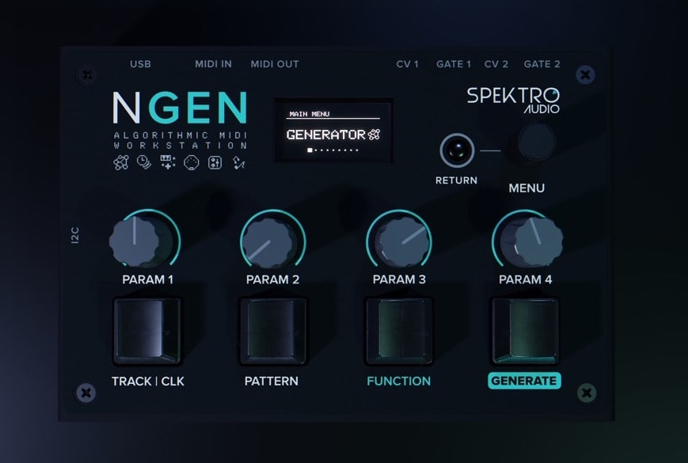

# NGEN – Algorithmic MIDI Workstation – User Manual

## About NGEN

NGEN is a unique 16-track MIDI sequencer designed in São Paulo / Brazil that lets you combine multiple algorithmic / generative generators and MIDI FXs to sequence multiple hardware or software MIDI instruments.

It offers a completely new way of creating and performing music by abstracting the composition process. Instead of writing sequences from scratch, NGEN lets you quickly generate a new sequence for your drums, basslines, melodies, and chord progressions with a push of a button.

NGEN includes classic Spektro Audio generators (ACDGEN and Polyform), completely new algorithmic generators (Drumgen, Samba, Arper, MARP, Pop, Turing, Shuffler), and  practical generators (Input Sequencer, MIDI Player, Thru).Each generator features an algorithm to combine different composition techniques with randomness so each generated sequence is unique.After generating a sequence, you can tweak it in real time using the parameters available for each of the generators. Take things even further by applying MIDI FXs such as Chord or Glitch to your sequences.All tracks in NGEN follow the same key and scale so it’s easier to get multiple sequences that work well with each other.Quickly save and restore your creations using patterns and projects stored in the microSD card.

NGEN's design is primarily focused on live performance so it features a 1.3" OLED screen, a minimalistic and easy to read interface, mechanical switches (Gateron Green), shortcuts for accessing different features, per track Program Change selector and auto-variation, extensive MIDI CC implementation, and a Performance mode for controlling up to 4 parameters at the same time.

NGEN also includes a variety of tools to let you explore this world of algorithmic sequencing such as assignable CV outputs, a built-in MIDI monitor, different clock generators, and much more.

**Product Page:** [http://spektroaudio.com/ngen](http://spektroaudio.com/ngen)

**Video Tutorials:** [NGEN Playlist on Youtube](http://spektroaudio.com/ngen)

## Firmware

Current version: 1.1.2 ([Change-Log](firmwareupdate.md#change-log))
