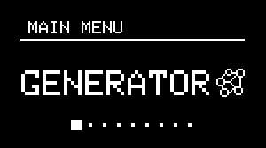
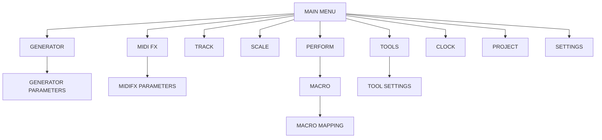
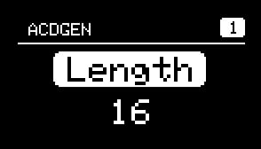
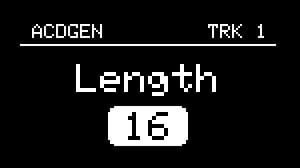
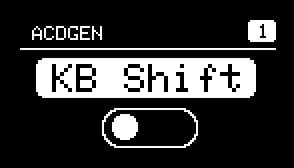
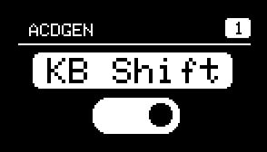
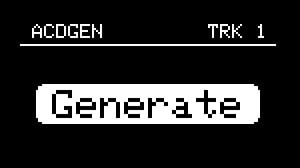
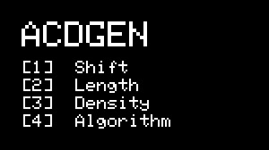
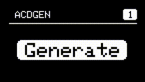

# Menu Navigation

---

## Main Menu


{align=right}

The NGEN menu system is designed to be easy to navigate using the ++"MENU ENCODER"++ and the ++"RETURN"++ button.

The unit boots into the Main Menu which lets you access all the different features available in NGEN. We've limited the maximum depth of the menu system to two levels (MAIN MENU > FEATURE SUB-MENU).  

<br/><br/>



<br/><br/>

Use the ++"MENU ENCODER"++  to scroll through the list of features and click the ++"MENU ENCODER"++ to navigate to a sub-menu. 
To return to the previous menu, press the ++"Return"++ button.

Different sub-menus can contain different menu items such as parameters, toggle switches, and actions which can be selected by scrolling the menu ++"MENU ENCODER"++.

<br/>

* **Parameters** (indicated by the parameter name on top and value at the bottom) can be controlled by clicking the ++"MENU ENCODER"++ to access the parameter's value and scrolling the ++"MENU ENCODER"++ to change it's value.

!!! Note
    Most parameter values are adjusted in real-time as you turn the encode but some (such as the Generator and MIDI FX selection in the Track sub-menu) require you to click the encoder to confirm the new value.

   
*Clicking the encoder on parameters switches between parameter selector and value*

<br/>

<div class="forced-pb"></div>

* **Switches** can be toggled by clicking the ++"MENU ENCODER"++.

 

<br/>

* **Actions** (indicated by the action name displayed on the center of the screen) can be called by clicking the ++"MENU ENCODER"++.



---

## Advanced Parameters and Settings

NGEN includes a variety of different features, settings and parameters that lets you use it in a variety of different ways but, to make it easier for you to get started, certain advanced parameters and settings are hidden by default.

To enable the advanced mode, go to [Settings](settings.md), enable Advanced and save your settings.

---

## Display Modes

To better display the appropriate information, NGEN automatically switches between different modes (Menu Navigation, Idle, and Parameter Visualization).

Menu Navigation is the default mode of the display.

When moving one of the PARAM knobs, NGEN will display the name, current value, and range of the parameter currently mapped to that knob.

While in Generator or Clock sub-menus, the display will switch to the selected Idle mode (Animation or Parameter List) after 5 seconds of no hardware interaction unless Idle Mode is set to ```OFF```.

---

## Idle Modes


### Animations


NGEN includes unique animations for Generators and Clock Generators, designed to provide visual feedback of their current state/functionality.

While displaying an animation, parameters modified via the 4 PARAM knobs are displayed on the top section of the display to prevent obstructing the animation.


### Parameter List



This idle mode displays a list of the parameters currently mapped to the 4 PARAM knobs and it's designed to help users get used to different mappings.


---

## UI Visual Effects

{align=right}

By default, NGEN uses certain display visual effects such as glitch transitions (after boot sequence and before entering Idle Mode) and display inversions (when generating a new sequence using the ++"GENERATE"++ button).

These effects can be disabled via the ```UI Visual FXs``` setting available in [Settings / Display](settings.md#display).

</br>

---

## Screensaver

{align=right}
In order to prevent display burn-in, NGEN's display will go into screensaver mode after a certain period (determined by the [Screensaver Period setting](settings.md#display)) of no hadware interaction (unless it's displaying an animation). 
The screensaver does not affect other functions so NGEN will continue to work normally while in screensaver mode.

To exit the screensaver mode, move any of the knobs or click on any of the buttons.


<br><br>

---


<div class="forced-pb"></div>


## Shortcuts
 
### Track Shortcuts

| **Action**                                            | **Shortcut**                                 |
|:------------------------------------------------------|:---------------------------------------------|
| Open Track Selector                                   | ++"TRACK/CLK"++                              |
| Quick Track Selection                                 | ++"TRACK/CLK (hold)"++  + ++"MENU ENCODER"++ |
| Open Track Settings                                   | ++"FUNCTION"++ + ++"TRACK/CLK"++             |
| Open Track Edit (while in Track sub-menu)             | ++"FUNCTION"++ + ++"TRACK/CLK"++             |
| Toggle Track Active (while in Track Selector)         | ++"FUNCTION"++ + ++"MENU ENCODER (click)"++  |
| Reload Track settings from active pattern             | ++"TRACK/CLK"++ + ++"MENU ENCODER (click)"++ |
| Trigger the Generate action for the active Generator  | ++"GENERATE"++                               |
| Trigger the secondary action for the active Generator | ++"FUNCTION"++ + ++"GENERATE"++              |


### Pattern Shortcuts

| **Action**                                                             | **Shortcut**                                       |
|:-----------------------------------------------------------------------|:---------------------------------------------------|
| Open Pattern Selector                                                  | ++"PATTERN"++                                      |
| Quick Pattern Selection                                                | ++"PATTERN (hold)"++  + ++"MENU ENCODER"++         |
| Save current pattern to selected pattern slot                          | ++"FUNCTION"++ + ++"MENU ENCODER (click)"++        |
| Open Pattern Edit (while in Pattern sub-menu)                          | ++"FUNCTION"++ + ++"PATTERN"++                     |
| Queue / Load next pattern                                              | ++"PATTERN"++ + ++"GENERATE"++                     |
| Queue / Load previous pattern                                          | ++"PATTERN"++ + ++"FUNCTION"++ + ++"GENERATE"++    |
| Reload active pattern                                                  | ++"PATTERN"++ + ++"RETURN"++                       |
| Generate Pattern ([Pattern Generation](pattern.md#pattern-generation)) | ++"TRACK/CLK"++  + ++"GENERATE"++                  |
| Variate Pattern                                                        | ++"TRACK/CLK"++  + ++"FUNCTION"++ + ++"GENERATE"++ |

### Clock Shortcuts

| **Action**                                      | **Shortcut**                                 |
|:------------------------------------------------|:---------------------------------------------|
| Quick Clock Selection (while in Clock sub-menu) | ++"TRACK/CLK (hold)"++  + ++"MENU ENCODER"++ |

### Perform Shortcuts

| **Action**                                        | **Shortcut**    |
|:--------------------------------------------------|:----------------|
| Toggle Track 1 Active (while in Perform sub-menu) | ++"TRACK/CLK"++ |
| Toggle Track 2 Active (while in Perform sub-menu) | ++"PATTERN"++   |
| Toggle Track 3 Active (while in Perform sub-menu) | ++"FUNCTION"++  |
| Toggle Track 4 Active (while in Perform sub-menu) | ++"GENERATE"++  |

### Song Mode Shortcuts

| **Action**         | **Shortcut**                                |
|:-------------------|:--------------------------------------------|
| Open Track Mutes   | ++"TRACK/CLK"++                             |
| Select next column | ++"MENU ENCODER (click)"++                  |
| Select next row    | ++"FUNCTION"++ + ++"MENU ENCODER (click)"++ |
| Move vertically (Column 1)<br>or Adjust Value    | ++"MENU ENCODER"++                          |
| Move horizontally  | ++"FUNCTION"++ + ++"MENU ENCODER"++         |
| Copy Event         | ++"FUNCTION"++ + ++"TRACK/CLK"++            |
| Paste Event        | ++"FUNCTION"++ + ++"PATTERN"++              |
| Clear Event        | ++"FUNCTION"++ + ++"RETURN"++               |
| Insert Blank Event       | ++"FUNCTION"++ + ++"GENERATE"++             |

