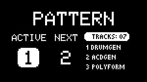
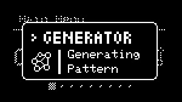
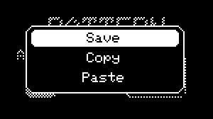
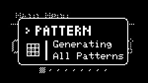
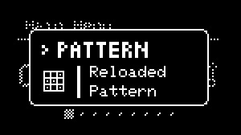

# Patterns

---

## About Patterns

{align=right}

The pattern system in NGEN is designed to let users create and perform different sections of a song/project. 
Patterns can store and recall settings for all tracks (including their Generators and MIDI FX). Global and clock settings are only stored in [**Projects**](projects.md). 

Each [Project](projects.md) can store up to 8 patterns.

To **load a pattern**, press the ++"PATTERN"++ button once to open the **Pattern Selector**, select the pattern using the ++"MENU ENCODER"++, and click on the encoder to load.  

To **save a pattern**, hold down ++"PATTERN"++ and press the ++"MENU ENCODER"++.

The **Pattern Selector** displays the active pattern on the left, the selected pattern on the center and the [Generator](generators.md) and [MIDI FX](midifx.md) selected for the first 3 active tracks.

---

## Pattern Generation

{align=right}

NGEN includes a new Pattern Generation feature that lets users generate an entire pattern at once by holding down ++"TRACK | CLK"++ and pressing the ++"GENERATE"++ button.
This shortcut will generate new sequences for all active tracks.

It's also possible to generate variations of the current pattern by holding down ++"TRACK | CLK"++ + ++"FUNCTION"++ and pressing the ++"GENERATE"++ button.

 
 
 

---

## Pattern Menu

{align=right}

The pattern edit menu can be accessed by holding down the ++"FUNCTION"++ button and pressing the ++"PATTERN"++ button (accessible from the Main Menu or from the Pattern Selector).

The menu includes options for saving, copying, pasting, and deleting the selected pattern.

 
 
 

---

## Generate All / Variate All

{align=right}

The last 2 options in the Pattern menu are **Generate All** and **Variate All**. These options let you explore NGEN's algorithmic pattern generation capabilities by generating or variating all patterns at once starting from the selected pattern.
These features can be used to create all 8 patterns in a project at once or to fill subsequent empty patterns.

**Generate All** generates 8 unique patterns and automatically saves them to the current project.

**Variate All** generates 8 variations of the current pattern and automatically saves them to the current project.

!!! warning
    Generate All and Variate All won't affect / overwrite already saved patterns. If you'd like to overwrite a pattern, make sure to delete it first.

 
 
 

---

## Pattern Reloading

{align=right}

NGEN includes a new feature that lets users quickly reload the active pattern from it's last saved state by holding down  ++"PATTERN"++ and pressing the ++"RETURN"++ button.

This feature is useful for quickly reloading an entire pattern after making changes to it during a live performance.

 
 
 

---

## Workflow Suggestion

The pattern system can be used to create, store and load different variations based on the initial pattern.

After creating your first pattern, return to the Main Menu and save it as pattern one.  
You can then create different variations by tweaking the different parameters and generating new sequences. To save each variation, load an empty pattern and save the current variation to it.

