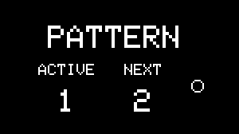

# Patterns

---

##About Patterns

{align=right}

The pattern system in NGEN is designed to let users create and perform different sections of a song/project. 
Patterns can store and recall settings for all tracks (including their Generators and MIDI FX). Global and clock settings are only stored in [**Projects**](projects.md). 

Each [Project](projects.md) can store up to 8 patterns.

To use patterns, you must first activate a Project by either saving or loading from the microSD card via the ```PROJECT``` sub-menu. Once a project is active, you can save and recall different patterns.

To **load a pattern**, press the ++"PATTERN"++ button once to open the **Pattern Selector**, select the pattern using the ++"MENU ENCODER"++, and click on the encoder to load.  
The circle on the right side of the Pattern Selector indicates if the selected pattern is empty or filled.  
Selecting an empty pattern won't affect the active sequences and parameters.

To **save a pattern**, return to the Main Menu, hold down **PATTERN** + **FUNCTION**, and press the encoder.

Saving a pattern automatically overwrites that pattern in the active [Project](projects.md) file therefore it's not necessary to save the Project afterward.

---

##Workflow Suggestion

The pattern system can be used to create, store and load different variations based on the initial pattern.

After creating your first pattern, return to the Main Menu and save it as pattern one.  
You can then create different variations by tweaking the different parameters and generating new sequences. To save each variation, load an empty pattern and save the current variation to it.


