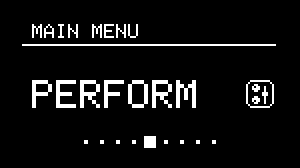
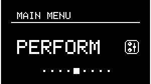

# Performance Mode

---

## About Performance Mode

{align=right}

NGEN includes a dedicated performance mode available under the **```PERFORM```** sub-menu.

Performance Mode includes 8 macro parameters that let you map up to 4 parameters of any Generator or MIDI FX, in any track, per macro and set specific ranges for each mapping.

Macro mappings are stored in [Project](projects.md) files and are recalled automatically when you load a Project.

---

## Macro mapping

<figure markdown>
     
<figcaption>Macro mapping process</figcaption>
</figure>

To map a parameter to a macro:

1 - Navigate to the **```PERFORM```** sub-menu

2 - Select a macro and click on the ++"MENU ENCODER"++ to adjust the macro mappings.

3 - Select the parameter slot number(```Param #```). 

3 - Select the ```> Map To Param``` to activate mapping mode (indicated by the **M→** icon on the display's top section).

4 - Navigate to a parameter and press the ++"MENU ENCODER"++ to select the displayed parameter.

5 - Adjust the minimum and maximum values via the ```Min``` and ```Max``` settings.

