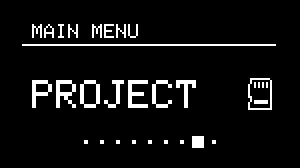

# Projects


---

## About Projects


{align=right}

Similarly to standard DAWs, NGEN can save and load entire sessions as project files. These files are stored in a microSD or directly to NGEN's internal memory (HW version 1.1 and above).

A project file contains data for [Tracks](track.md) (including data for the active [**Generators**](generators.md), [**MIDI FX**](midifx.md) and I/O routings), [**Clock Generators**](clockgen.md), [**Scale**](scale.md), Perform Mode, and [**Patterns**](pattern.md).

After saving or loading a project, that project becomes the active project for all [Patterns](pattern.md).

To **save a project**, navigate to the Projects sub-menu, select the ```Save``` or ```Save As``` option. Save As option will prompt you to name the project file.

To **load a project**, navigate to the Projects sub-menu, select the ```Load``` option, and select what file you'd like to load.

To **create a new project** file, navigate to the Projects sub-menu, select the ```New``` option. This will clear all data from the current project and create a new one.


Projects can not be renamed through NGEN's interface. To rename a project, connect the microSD card to your computer (via a microSD to USB adapter) and rename the files inside the Projects folder (we suggest limiting the filename to 10 characters).

---

## Loading and Saving Projects During Playback

It is possible to load and save projects while NGEN is playing without any interruptions. 

Projects are cached and loaded at the beginning of the next bar. This allows you to switch between projects as if you were switching between patterns.  
This feature is particularly useful for live performances and jam sessions where projects can used to different songs or sections of a song.

NGEN uses a separate core to handle the loading and saving of projects, ensuring that the audio engine is not interrupted during the process.

!!! attention
    If you plan on switching between projects during a performance, make sure you have the same [Clock Generators](clockgen.md) enabled in the projects you're switching between.
