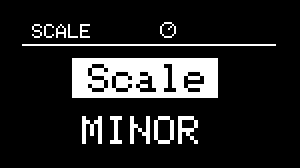
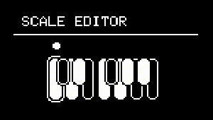

# Scale

---

## About Scale

{align=right}
Because NGEN is designed with live performance in mind, most of the Generators process notes in terms of musical intervals rather than specific notes. Therefore these Generators use the selected **Key** and **Scale** in the **SCALE** sub-menu to translate those intervals to the appropriate notes.

This approach lets the user change the **Key** and **Scale** of all **[Tracks](track.md)** simultaneously via the **SCALE** sub-menu (available in the **MAIN MENU**).

A global Octave control is also available under the Scale sub-menu.

---

## List of Available Scales

- Minor

- Major

- Harmonic Minor (```mHARM```)

- Melodic Minor (```mMELO```)

- Major Pentatonic (```MPENT```)

- Minor Pentatonic (```mPENT```)

- Blues

- Dorian (```DORIA```)

- Lydian (```LYDIA```)

- Locrian (```LOCRI```)

- Arabic (```ARAB```)

- Augmented (```AUGM```)

- Wholetone (```WHOLE```)

- Phrygian (```PHRYG```)

- Chromatic (```CHROM```)

---

<div class="forced-pb"></div>

## Scale Editor

{align=right}

The Scale Editor allows you edit the currently selected scale by enabling or disabling notes.

Use the ++"MENU ENCODE"++ to select a note and press the ++"MENU ENCODE"++ to toggle it on or off.

To return to the Scale menu, press the ++"RETURN"++ button.

!!! warning
	The Scale Editor is a beta feature and subject to change. Changes made in the Scale Editor are only temporary. Selecting a different scale will reset the changes made in the Scale Editor.