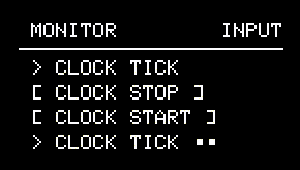

# Tools

--- 

## About Tools

The Tools sub-menu contains different features that can be used to monitor, control, and configure NGEN's settings.

---

## List of Available Tools

### MIDI MONITOR (```MONITOR```)

{align=right}
The built-in MIDI Monitor lets you track incoming and outgoing MIDI messages.
It can be used to make sure that NGEN is receiving MIDI clock, notes, and control changes from other devices and that it's also sending MIDI messages appropriately.

The four columns in the MIDI Monitor represent message type, number (note or CC number), value, and channel.

To switch between ```IN``` and ```OUT```, press the ++"GENERATE"++ button.


### TEMPLATE

The Template tool lets you load different track setup templates (Generator / MIDI FX / Clock Rate / Routings) to your current pattern.

Available templates:

#### House:

| ** Track Number ** | ** Generator ** | ** MIDI FX ** | **Input Channel** | **Output Channel** | **Aux Output** | **Clock Rate** |        **Note**        |
|:------------------:|:---------------:|:-------------:|:-----------------:|:------------------:|:--------------:|:--------------:|:----------------------:|
|         1          |     DRUMGEN     |       -       |         1         |         1          |       -        |      1/16      |       Main drums       |
|         2          |     ACDGEN      |       -       |         2         |         2          |       3        |      1/16      |          Bass          |
|         3          |    POLYFORM     |       -       |         3         |         3          |       -        |      1/16      | Polyphonic short synth |
|         4          |     ACDGEN      |       -       |         4         |         4          |       -        |      1/16      |       Lead synth       |
|         5          |      ARPER      |       -       |         5         |         5          |       -        |      1/16      | Percussive instrument  |
|         6          |       POP       |   HUMANIZER   |         6         |         6          |       -        |      1/16      |         Piano          |
|         7          |      SAMBA      |       -       |         7         |         7          |       -        |      1/16      |       Percussion       |

#### Jungle:

| ** Track Number ** | ** Generator ** | ** MIDI FX ** | **Input Channel** | **Output Channel** | **Aux Output** | **Clock Rate** |      ** Note **       |
|:------------------:|:---------------:|:-------------:|:-----------------:|:------------------:|:--------------:|:--------------:|:---------------------:|
|         1          |    SHUFFLER     |       -       |         1         |         1          |       -        |      1/8       | 1/8 Sliced Drum Break |
|         2          |     ACDGEN      |       -       |         2         |         2          |       -        |       1        |  Pads / Legato Synth  |
|         3          |     ACDGEN      |       -       |         3         |         3          |       -        |      1/8       |       Sub Bass        |
|         4          |     ACDGEN      |       -       |         4         |         4          |       -        |      1/8       |     Sampled Stab      |
|         5          |      ARPER      |   HUMANIZER   |         5         |         5          |       -        |      1/8       |       Arp Synth       |

#### Gen Demo:


| ** Track Number ** | ** Generator ** | ** MIDI FX ** | **Input Channel** | **Output Channel** | **Aux Output** | **Clock Rate** | ** Note ** |
|:------------------:|:---------------:|:-------------:|:-----------------:|:------------------:|:--------------:|:--------------:|:----------:|
|         1          |     ACDGEN      |       -       |         1         |         1          |       -        |      1/16      |            |
|         2          |      ARPER      |       -       |         2         |         2          |       -        |      1/16      |            |
|         3          |     DRUMGEN     |       -       |         3         |         3          |       -        |      1/16      |            |
|         4          |      INSEQ      |       -       |         4         |         4          |       -        |      1/16      |            |
|         5          |      MARP       |       -       |         5         |         5          |       -        |      1/16      |            |
|         6          |   MIDIPLAYER    |       -       |         6         |         6          |       -        |      1/16      |            |
|         7          |    POLYFORM     |       -       |         7         |         7          |       -        |      1/16      |            |
|         8          |       POP       |       -       |         8         |         8          |       -        |      1/16      |            |
|         9          |      SAMBA      |       -       |         9         |         9          |       -        |      1/16      |            |
|         10         |    SHUFFLER     |       -       |        10         |         10         |       -        |      1/16      |            |
|         11         |      THRU       |       -       |        11         |         11         |       -        |      1/16      |            |
|         12         |     TURING      |       -       |        12         |         12         |       -        |      1/16      |            |
|         13         |       NSL       |       -       |        13         |         13         |       -        |      1/16      |            |
