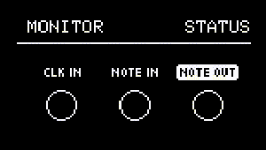
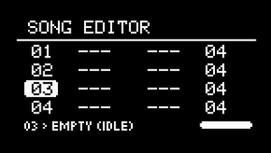
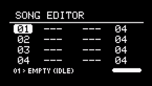
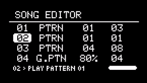

# Tools

--- 

## About Tools

The Tools sub-menu contains different features that can be used to monitor, control, and configure NGEN's settings.

---

## MIDI Monitor (```Monitor```)

{align=right}

The built-in MIDI Monitor lets you track incoming and outgoing MIDI messages.
It can be used to make sure that NGEN is receiving MIDI clock, notes, and control changes from other devices and that it's also sending MIDI messages appropriately.

The four columns in the MIDI Monitor represent message type, number (note or CC number), value, and channel.

To switch between the different views (```INPUT```, ```OUTPUT```, and ```STATUS```), turn the ++"MENU ENCODER"++ or press the ++"GENERATE"++ button.

### Status View

{align=right}


The ```STATUS``` view contains 3 indicators that can be used to quickly monitor if NGEN is receiving and sending MIDI.

- ```CLK IN``` indicates if NGEN is actively receiving MIDI Clock

- ```NOTE IN``` indicates if NGEN is actively receiving MIDI note messages

- ```NOTE OUT``` indicates if NGEN is actively sending MIDI note messages

---

## Template

The Template tool lets you load different track setup templates (Generator / MIDI FX / Clock Rate / Routings) to your current pattern.

Available templates:

### House:

| **Track Number** | **Generator** | **MIDI FX** | **Input Channel** | **Output Channel** | **Aux Output** | **Clock Rate** |        **Note**        |
|:----------------:|:-------------:|:-----------:|:-----------------:|:------------------:|:--------------:|:--------------:|:----------------------:|
|        1         |    DRUMGEN    |      -      |         1         |         1          |       -        |      1/16      |       Main drums       |
|        2         |    ACDGEN     |      -      |         2         |         2          |       3        |      1/16      |          Bass          |
|        3         |   POLYFORM    |      -      |         3         |         3          |       -        |      1/16      | Polyphonic short synth |
|        4         |    ACDGEN     |      -      |         4         |         4          |       -        |      1/16      |       Lead synth       |
|        5         |     ARPER     |      -      |         5         |         5          |       -        |      1/16      | Percussive instrument  |
|        6         |      POP      |  HUMANIZER  |         6         |         6          |       -        |      1/16      |         Piano          |
|        7         |     SAMBA     |      -      |         7         |         7          |       -        |      1/16      |       Percussion       |

### Jungle:

|**Track Number**|**Generator**|**MIDI FX**| **Input Channel** | **Output Channel** | **Aux Output** | **Clock Rate** |     **Note**      |
|:------------------:|:---------------:|:-------------:|:-----------------:|:------------------:|:--------------:|:--------------:|:---------------------:|
|         1          |    SHUFFLER     |       -       |         1         |         1          |       -        |      1/8       | 1/8 Sliced Drum Break |
|         2          |     ACDGEN      |       -       |         2         |         2          |       -        |       1        |  Pads / Legato Synth  |
|         3          |     ACDGEN      |       -       |         3         |         3          |       -        |      1/8       |       Sub Bass        |
|         4          |     ACDGEN      |       -       |         4         |         4          |       -        |      1/8       |     Sampled Stab      |
|         5          |      ARPER      |   HUMANIZER   |         5         |         5          |       -        |      1/8       |       Arp Synth       |

### Gen Demo:


|**Track Number**|**Generator**|**MIDI FX**| **Input Channel** | **Output Channel** | **Aux Output** | **Clock Rate** |**Note**|
|:------------------:|:---------------:|:-------------:|:-----------------:|:------------------:|:--------------:|:--------------:|:----------:|
|         1          |     ACDGEN      |       -       |         1         |         1          |       -        |      1/16      |            |
|         2          |      ARPER      |       -       |         2         |         2          |       -        |      1/16      |            |
|         3          |     DRUMGEN     |       -       |         3         |         3          |       -        |      1/16      |            |
|         4          |      INSEQ      |       -       |         4         |         4          |       -        |      1/16      |            |
|         5          |      MARP       |       -       |         5         |         5          |       -        |      1/16      |            |
|         6          |   MIDIPLAYER    |       -       |         6         |         6          |       -        |      1/16      |            |
|         7          |    POLYFORM     |       -       |         7         |         7          |       -        |      1/16      |            |
|         8          |       POP       |       -       |         8         |         8          |       -        |      1/16      |            |
|         9          |      SAMBA      |       -       |         9         |         9          |       -        |      1/16      |            |
|         10         |    SHUFFLER     |       -       |        10         |         10         |       -        |      1/16      |            |
|         11         |      THRU       |       -       |        11         |         11         |       -        |      1/16      |            |
|         12         |     TURING      |       -       |        12         |         12         |       -        |      1/16      |            |
|         13         |       NSL       |       -       |        13         |         13         |       -        |      1/16      |            |


---

## Song Mode


The Song Mode available in NGEN works as 64-step event sequencer that can be used not only to sequence patterns, but also to sequence and automate actions like [Pattern] and [Track] generation, variation, and reloading.

When active, Song Mode will advance through the event list and trigger actions according to the settings of each event, without blocking any other user actions.

Besides it's primary use-case (to arrange patterns in to a song), Song Mode can also be used an automation tool for sequencing different actions like track muting, pattern / track generation, and track state randomization.

The Song Mode settings and data are stored in [Projects](projects.md).

### Song Editor

{align=right}

The Song Mode Editor view consists of a grid of 4 columns and 4 rows. 
Each row represents an event slot and each column represents a value associated with that event: slot number, event type, value, and duration (in bars).

Turning the ++"MENU ENCODER"++ adjusts the selected column and clicking it advances to the next column.

It's also possible to move between columns by holding down ++"FUNCTION"++ while turning the ++"MENU ENCODER"++.

To scroll through the event slot list, select the first column (slot number) and turn the ++"MENU ENCODER"++.

### Events

Each event slot can be set to a different event **type**, event **value**, and **length** (0 to 32 bars).



The currently available event types are:

|            **Event Type**             |                             **Description**                             |      **Value**       |
|:-------------------------------------:|:-----------------------------------------------------------------------:|:--------------------:|
|          Empty (```Empty```)          |                         Empty event slot (idle)                         |         N/A          |
|       Play Pattern (```PTRN```)       |               Loads a pattern (with optional track mutes)               | Pattern to be loaded |
|    Generate Pattern (```G.PTN```)     |   Triggers a [**Pattern Generation**](pattern.md#pattern-generation)    | Probability (0-100%) |
|     Generate Track (```G.TRK```)      | Triggers the "**Generate**" action in the selected track (1 through 16) |     Track Number     |
|     Variate Pattern (```V.PTN```)     |            Generates a **variation** of the current pattern             | Probability (0-100%) |
|      Variate Track (```V.TRK```)      | Triggers the "**Variate**" action in the selected track (1 through 16)  |     Track Number     |
|     Reload Pattern (```R.PTN```)      |                       Reloads the active pattern                        | Probability (0-100%) |
|      Reload Track (```R.TRK```)       |                       Reloads the selected track                        |     Track Number     |
| Randomize Pattern State (```S.PTN```) |                Randomizes the Track State of all tracks                 | Probability (0-100%) |
|  Randomize Track State (```S.TRK```)  |            Randomizes the Track State of the selected track             |     Track Number     |
|           Jump (```JUMP```)           |              Move the song position to the selected event               |  Event Slot Number   |


###  Track Mutes

{align=right}

Event Slots also include optional track mutes (per slot) that can be used to create further variations of existing patterns. 
When loading a pattern, NGEN will automatically turn off the "Active" parameter of the muted tracks.

To open the Track Mute UI, press the ++"TRACK | CLK"++ button.

Turn the ++"MENU ENCODER"++ to select between the 16 available tracks and click the ++"MENU ENCODER"++ to mute / unmute the selected track.

Press the ++"RETURN"++ button to return to the main Song Editor view.

### Shortcuts

|                 **Shortcut**                 |                       **Description**                       |
|:--------------------------------------------:|:-----------------------------------------------------------:|
|         ++"MENU ENCODER"++ (Scroll)          | Adjusts the selected value / Scroll vertically (1st column) |
| ++"FUNCTION"++ + ++"MENU ENCODER"++ (Scroll) |                     Scroll horizontally                     |
|          ++"MENU ENCODER"++ (Click)          |                   Selects the next column                   |
| ++"FUNCTION"++ + ++"MENU ENCODER"++ (Click)  |                    Selects the next row                     |
|               ++"TRACK/CLK"++                |                   Opens the Track Mute UI                   |
|       ++"FUNCTION"++ + ++"TRACK/CLK"++       |                  Copies the selected event                  |
|        ++"FUNCTION"++ + ++"PATTERN"++        |          Pastes event into the selected event slot          |
|        ++"FUNCTION"++ + ++"RETURN"++         |                 Removes the selected event                  |
|       ++"FUNCTION"++ + ++"GENERATE"++        |      Inserts an empty event at the selected event slot      |
