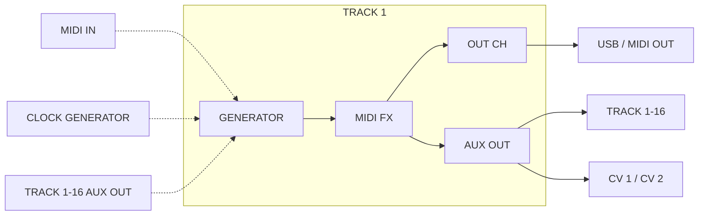

#Tracks

---

##About Tracks

{align=right}

The NGEN features 16 tracks that work similarly to MIDI tracks in standard DAWs. Each track can be set to a different [Generator](generator.md), [MIDI FX](midifx.md), Program Change and I/O settings.

The track settings can be accessed via the **TRACK** sub-menu available in the **MAIN MENU** or via the ++"FUNCTION"++ + ++"TRACK"++ [shortcut](menunavegation.md#shortcuts).


--- 

##Selecting a Track

{ align=right }

To select a different track, press the ++"TRACK / CLK"++ button, use the ++"MENU ENCODER"++ to scroll through the different tracks and press the ++"MENU ENCODER"++ or the ++"RETURN"++ button to return to the previous screen.  
Alternatively, turn the ++"MENU ENCODER"++ while holding down the ++"TRACK / CLK"++ button to automatically return to the previous screen.

When a new track is selected, it automatically becomes the **active** track, meaning the four NGEN knobs (as well as the ++"GENERATE"++ button) will affect its parameters.

---

##Tracks Internal Routing

When triggered by a [Clock Generator](clockgen.md), a track will trigger the selected [Generator](generators.md). The MIDI output of the Generator is then sent to the input of the selected [MIDI FX](midifx.md).

The MIDI output of the MIDI FX is then sent to the track's main and auxiliary outputs.  
The main output is always routed to the USB / MIDI Out on the selected MIDI channel (OUT CH).
The auxiliary output can be used for sending MIDI messages generated by a track (post MIDI FX) to the input of another track or one of the [CV outputs](setup.md#connecting-via-cv).

Tracks can also receive MIDI from external sources (via USB or MIDI IN) and other tracks (routed via the AUX OUT). Some [Generators](generators.md) (such as [Polyform](generators.md#polyform)) can process incoming MIDI notes.




---


##Track Settings

| **Setting** | **Description** | **[Advanced](menunavegation.md#advanced-parameters-and-settings) ** |
|---|---|:--:|
|**Status**|The Status toggle lets you enable or disable certain tracks. Disabled tracks will not be processed and will not generate any MIDI notes| |
| **[Generator](generators.md)** | Selects one of the available generators for the track||
| **[MIDI FX](midifx.md)** | Selects one of the available MIDI FX for the track | | 
| **Clock Rate** | Sets the clock rate used by the Generator and MIDI FX ([MIDI Clock](clockgen.md#midi-clock) only) |:material-check:| 
| **Auxiliary Output (```AUX OUT```)** | Sets the track's auxiliary output (for routing the track's output to another track's input) |:material-check:| 
| **Output Channel (```OUT CH```)** | Sets the track MIDI output channel |:material-check: |
| **Input Channel (```IN CH```) ** | Sets the track MIDI input channel | :material-check: |
| **Program Change (```PROGRAM```)** | Sets the MIDI Program Change number which gets send to the MIDI output when loading a project or a pattern | :material-check: |
| **Auto Variate (```AUTO VAR```)** | Enable / disable the [Auto Variate](tools.md#auto-variate-auto-vari8) mode | :material-check: |

---

Page last revised on: {{ git_revision_date }}