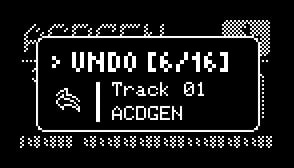

# Undo

---

## About Undo System
{align=right}
The Undo System in NGEN allows users to quickly revert to previously generated sequences for [[Generators](generators.md#generator)](generators.md#generator), MIDI FXs, or Clocks by pressing ++"GENERATE"++ + ++"RETURN"++.

When a new sequence is generated, NGEN caches the current state of that component, including parameter values, prior to the new generation. To maintain reasonable memory usage, NGEN stores the last 16 generated sequences in memory.

The Undo System is currently available for:

| Generators | MIDI FXs  | Clock Generators |
|------------|-----------|------------------|
| ACDGEN     | Accent    | FreeClock        |
| Arper      | Modulator |                  |
| DrumGen    | ProgSeq   |                  |
| Luar       |           |                  |
| MARP       |           |                  |
| NSL Engine |           |                  |
| Polyform   |           |                  |
| Pop        |           |                  |
| Samba      |           |                  |
| Shuffler   |           |                  |
| Turing     |           |                  |
## Limitations

- Sequences are only saved to the undo cache when a new sequence is generated.

- Parameter changes made during pattern generation are not saved or cached.

- When a [Pattern Generation](pattern.md#pattern-generation) is triggered, NGEN saves each track generator and MIDI FX as individual sequences. Previous sequences are added to the undo cache and can be restored individually; however, it is not possible to revert a Pattern Generation as a single action.

- [Generators](generators.md#generator) such as Thru, and MIDI FXs like Chords or Glitch, which do not use internal sequences, are not cached.

- Cached sequences can only be reverted to their original Track and Generator / MIDI FX.

- The undo cache is not persistent: it will be lost after a reboot and is not saved with project files.

